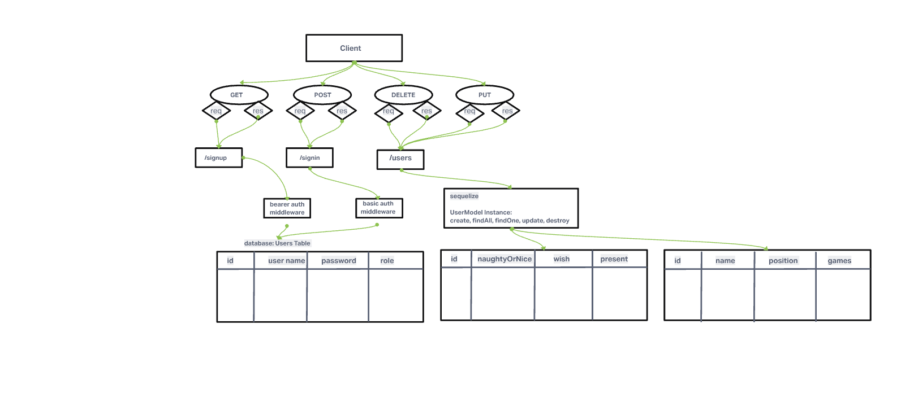

# LAB - Class 09

## Project: Santa's Little Helper

### Author: Yen Xiong Yuan & Jordan Covington

### Problem Domain  

An API Auth Server with an ACL to help Santa with organizing for Christmas.  

### Links and Resources

- [back-end server url](https://santas-little-helper.onrender.com) 

### Setup

#### `.env` requirements (where applicable)

PORT, DATABASE_URL, SECRET

#### How to initialize/run your application (where applicable)

'npm install' for dependencies
`npm start`

#### How to use your library (where applicable)

#### Features / Routes

- Feature One: Checking Santa's List

- GET : `/api/v1/list` - see all kids on the list
- GET : `/api/v1/list/:id` - specific kid on the list
- POST : `/api/v1/list` - Add a kid to the list
- PUT : `/api/v1/list/:id` - Update a kid on the list
- DELETE : `/api/v1/list/:id` - Delete a kid from the list
- SCHEMA : `name`, `naughtyOrNice`, `wish`, `present`

- Feature Two: Checking Reindeer Status

- GET : `/api/v1/reindeer` - see all reindeer on the list
- GET : `/api/v1/reindeer/:id` - specific reindeer on the list
- POST : `/api/v1/reindeer` - Add a reindeer to the list
- PUT : `/api/v1/reindeer/:id` - Update a reindeer on the list
- DELETE : `/api/v1/reindeer/:id` - Delete a reindeer from the list
- SCHEMA : `name`, `position`, `games`

- Feature Three: Signin/Signup

- POST : `/signup` - Creates a user
- POST : `/signin` - Logs a user in
- SCHEMA : `username`, `password`, `role`
- ROLES : `parent`, `elf`, `msclaus`, `santa`

#### Tests

- How do you run tests?   We used ThunderClient for testing
- Any tests of note?  We tested all CRUD functionality

#### UML

